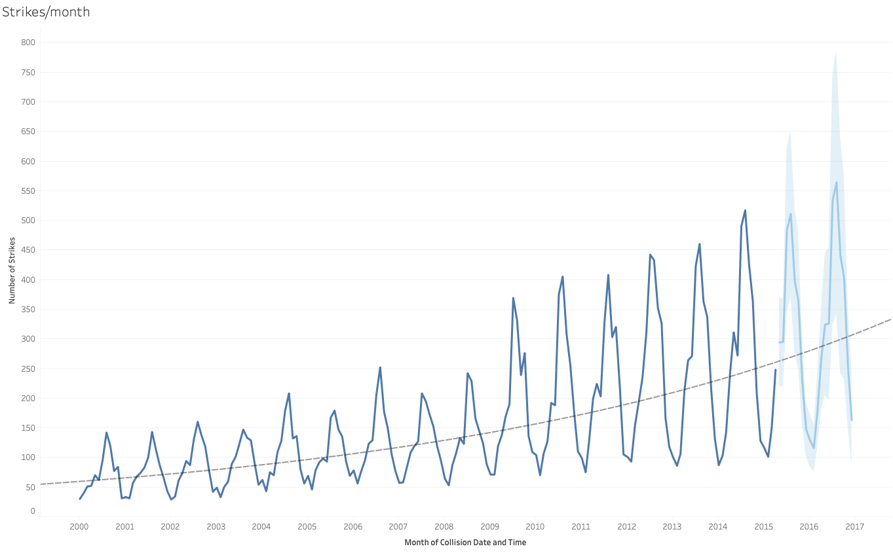
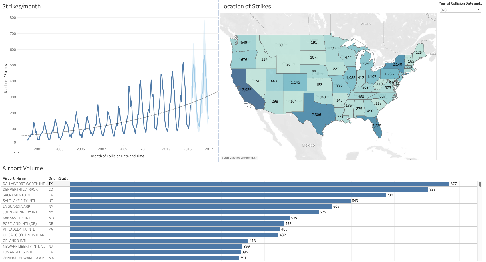
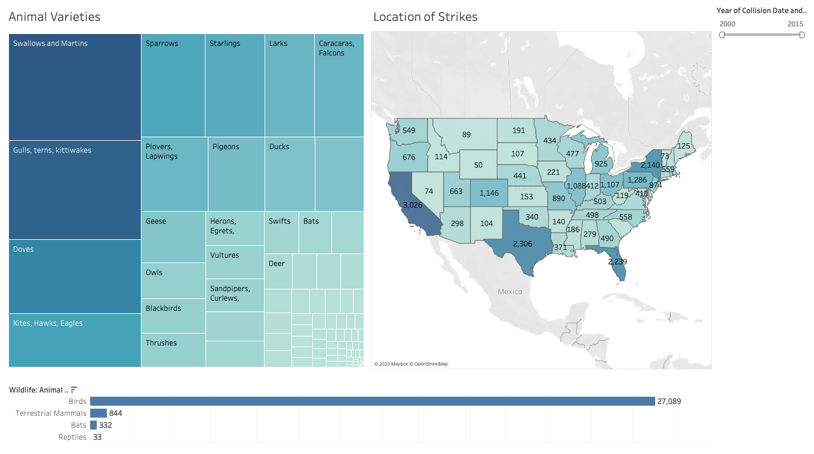
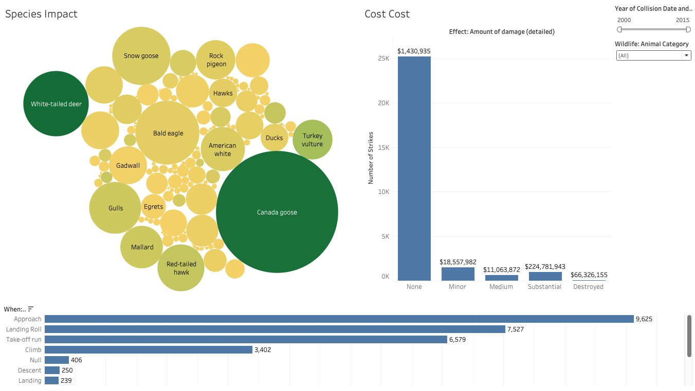

# Final-Project-Tableau

## Project/Goals
For this project I chose the FAA Wildlife Strikes dataset. My goals for this project are:

- To identify the geographical distribution of strikes and understand how they change with time.
- To identify trends within wildlife species and their associated impacts.

## Process
After general investigation of the available fields and their types and conditions the approach taken was to split the investigation into 3 phases. With each phase looking at a different aspect of the data; time and location, species distribution and collision impact.

## Results
For this project I chose the FAA Wildlife Strikes dataset. The dataset covers reported collisions between wildlife and aircraft in the USA from 2000 to 2015. The dataset is a subset of information from the FAA website and reports on the several features of stike location, timing, impact and wildlife type.

### Time series trends and geographic locations
The time series below shows there is a general yearly increase in wildlife strikes across the US. The stikes follow a seasonal trend increasing throughout Spring and Summer with a yearly peak found in August. The seasonal trends likley correspond with seasonal spikes in bird populations as well as spikes in aviation activity (people fly more in good weather). The general increase in the volume of stikes could be attributed to the increase in demand for flights. One external source reported a 180% increase in the demand for airtravel worldwide for airtravel over the same period. An exponential trendline provide the highest R^2 (0.49) and a 2 year forecast was added. See graph below:

Timeseries data was combined in a Dashboard with a map visual for the total number of stikes and a bar chart of the sum of stikes per airport. Each chart is linked so that users can pick a time or location of interst and see how it changed with time. 

### Wildlife species and their impacts
A dashboard was created to provide an overview of the most common animal types and varieties that are involved in strikes. As with the previous dashboard all the figures will filter eachother as well as the other dashboards. This allows the users to investigate the most problematic species based on gegraphic lcation, animal type or year. Unsurprising but interesting insights that can be gained here are investigation of the local varieties of animals for a given state, for example: in general birds are the mostly likely animal to be involved in a stike , specifically Swallows or Martins. Or over a 15 year period there have been 12 unfortunate turtles in Florida that have been involved in collisions with an aircraft.

A dashboard was created to allow users to assess the impacts of collisions with certain animals. Once again proving it's capacity for interupting transport and taking on animals (or machines) far bigger than itself, the Canadian Goose was found to be the leading cause in dollars lost and a close second in time lost as a result of it's altercations with aircraft. The brazen bird accounts for almost 10% of all aircraft destoryed or substantially damaged by collisions. The collisions with the unfortunate turtles from Florida thankfully did not result in any damage to the aircraft, although it is unlikely the same can be said about the damge to the turtles. 1 audacious turtle was hit on "approach" which seems out of character for the typically grounded testudines.

## Challenges 
The main challange encountered was having to repeat the project due to Tableau crashing while I was saving the project to submit it. Overall it was interesting topic to investigate.

## Future Goals
If more time was an option it would have been very interesting to make an assessment of the frequency of impacts with wildlife. This would have required a separate datasource for flight volume during the same period.

In addition the raw dataset from the FAA website contains a larger number of fields that would have been interesting to dig into, such as aircraft size and location of impact.